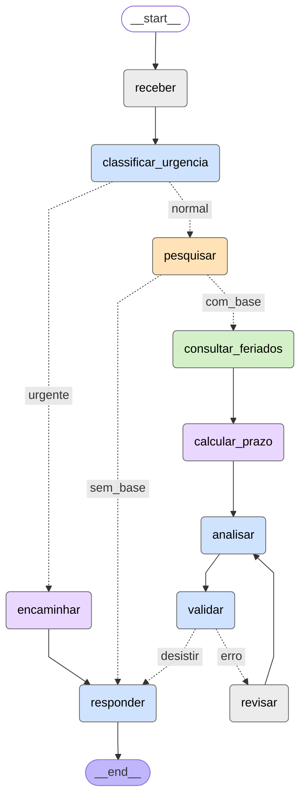

# Grafo por tipo de nó

```mermaid
---
config:
  flowchart:
    curve: linear
---
graph TD;
	__start__([<p>__start__</p>]):::first
	receber(receber)
	classificar_urgencia(classificar_urgencia)
	encaminhar(encaminhar)
	responder(responder)
	pesquisar(pesquisar)
	analisar(analisar)
	validar(validar)
	revisar(revisar)
	consultar_feriados(consultar_feriados)
	calcular_prazo(calcular_prazo)
	__end__([<p>__end__</p>]):::last
	__start__ --> receber;
	analisar --> validar;
	calcular_prazo --> analisar;
	classificar_urgencia -. &nbsp;urgente&nbsp; .-> encaminhar;
	classificar_urgencia -. &nbsp;normal&nbsp; .-> pesquisar;
	consultar_feriados --> calcular_prazo;
	encaminhar --> responder;
	pesquisar -. &nbsp;com_base&nbsp; .-> consultar_feriados;
	pesquisar -. &nbsp;sem_base&nbsp; .-> responder;
	receber --> classificar_urgencia;
	revisar --> analisar;
	validar -. &nbsp;desistir&nbsp; .-> responder;
	validar -. &nbsp;erro&nbsp; .-> revisar;
	responder --> __end__;
	classDef default fill:#f2f0ff,line-height:1.2
	classDef first fill-opacity:0
	classDef last fill:#bfb6fc
	classDef tipo0 fill:#cfe3ff,stroke:#666,color:#000;
	class classificar_urgencia,analisar,validar,responder tipo0;
	classDef tipo1 fill:#ffe2b8,stroke:#666,color:#000;
	class pesquisar tipo1;
	classDef tipo2 fill:#d4f0c8,stroke:#666,color:#000;
	class consultar_feriados tipo2;
	classDef tipo3 fill:#ead7ff,stroke:#666,color:#000;
	class encaminhar,calcular_prazo tipo3;
	classDef tipo4 fill:#ececec,stroke:#666,color:#000;
	class receber,revisar tipo4;

```
