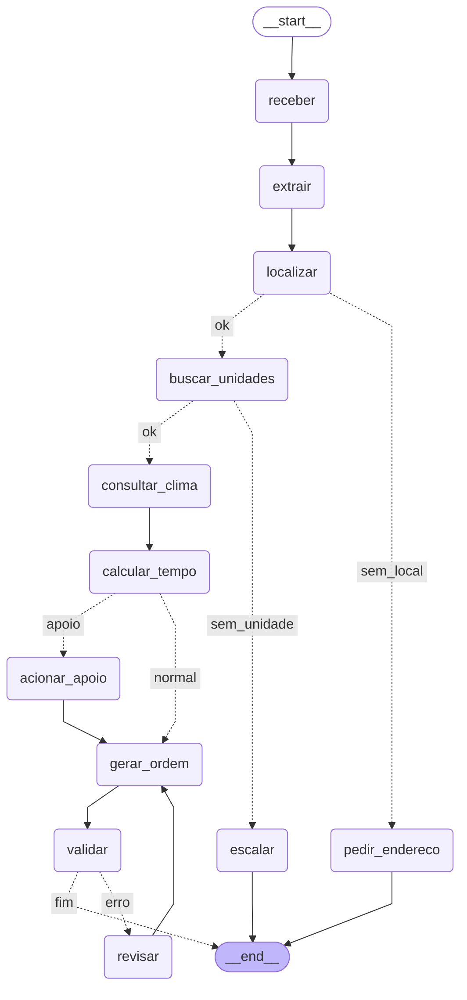

# Grafo atual

```mermaid
---
config:
  flowchart:
    curve: linear
---
graph TD;
	__start__([<p>__start__</p>]):::first
	receber(receber)
	extrair(extrair)
	localizar(localizar)
	pedir_endereco(pedir_endereco)
	buscar_unidades(buscar_unidades)
	escalar(escalar)
	consultar_clima(consultar_clima)
	calcular_tempo(calcular_tempo)
	acionar_apoio(acionar_apoio)
	gerar_ordem(gerar_ordem)
	validar(validar)
	revisar(revisar)
	__end__([<p>__end__</p>]):::last
	__start__ --> receber;
	acionar_apoio --> gerar_ordem;
	buscar_unidades -. &nbsp;ok&nbsp; .-> consultar_clima;
	buscar_unidades -. &nbsp;sem_unidade&nbsp; .-> escalar;
	calcular_tempo -. &nbsp;apoio&nbsp; .-> acionar_apoio;
	calcular_tempo -. &nbsp;normal&nbsp; .-> gerar_ordem;
	consultar_clima --> calcular_tempo;
	extrair --> localizar;
	gerar_ordem --> validar;
	localizar -. &nbsp;ok&nbsp; .-> buscar_unidades;
	localizar -. &nbsp;sem_local&nbsp; .-> pedir_endereco;
	receber --> extrair;
	revisar --> gerar_ordem;
	validar -. &nbsp;fim&nbsp; .-> __end__;
	validar -. &nbsp;erro&nbsp; .-> revisar;
	escalar --> __end__;
	pedir_endereco --> __end__;
	classDef default fill:#f2f0ff,line-height:1.2
	classDef first fill-opacity:0
	classDef last fill:#bfb6fc

```
