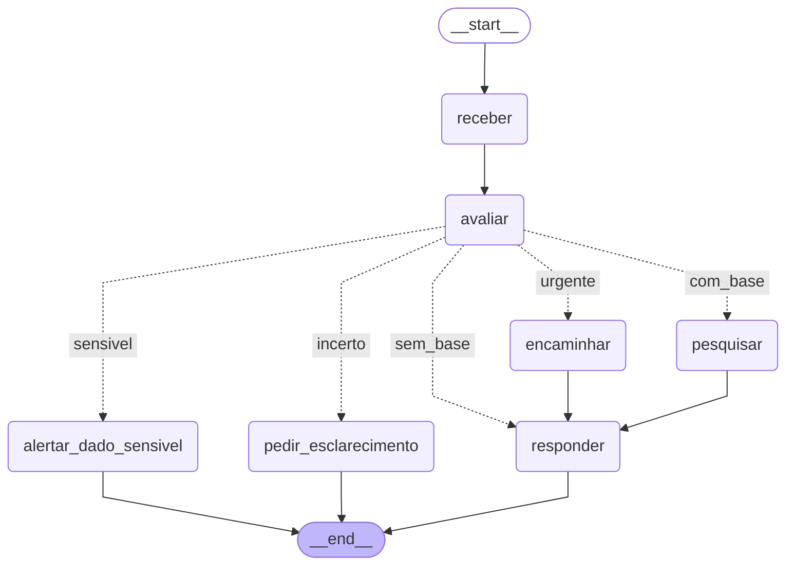

# Grafo atual

```mermaid
---
config:
  flowchart:
    curve: linear
---
graph TD;
	__start__([<p>__start__</p>]):::first
	receber(receber)
	avaliar(avaliar)
	encaminhar(encaminhar)
	responder(responder)
	alertar_dado_sensivel(alertar_dado_sensivel)
	pedir_esclarecimento(pedir_esclarecimento)
	pesquisar(pesquisar)
	__end__([<p>__end__</p>]):::last
	__start__ --> receber;
	avaliar -. &nbsp;sensivel&nbsp; .-> alertar_dado_sensivel;
	avaliar -. &nbsp;urgente&nbsp; .-> encaminhar;
	avaliar -. &nbsp;incerto&nbsp; .-> pedir_esclarecimento;
	avaliar -. &nbsp;com_base&nbsp; .-> pesquisar;
	avaliar -. &nbsp;sem_base&nbsp; .-> responder;
	encaminhar --> responder;
	pesquisar --> responder;
	receber --> avaliar;
	alertar_dado_sensivel --> __end__;
	pedir_esclarecimento --> __end__;
	responder --> __end__;
	classDef default fill:#f2f0ff,line-height:1.2
	classDef first fill-opacity:0
	classDef last fill:#bfb6fc

```
