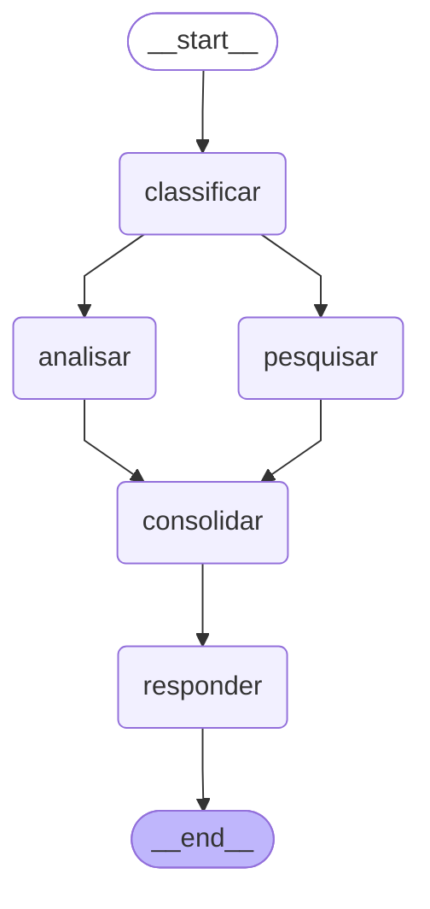

# 07_dag

```mermaid
---
config:
  flowchart:
    curve: linear
---
graph TD;
	__start__([<p>__start__</p>]):::first
	classificar(classificar)
	pesquisar(pesquisar)
	analisar(analisar)
	consolidar(consolidar)
	responder(responder)
	__end__([<p>__end__</p>]):::last
	__start__ --> classificar;
	analisar --> consolidar;
	classificar --> analisar;
	classificar --> pesquisar;
	consolidar --> responder;
	pesquisar --> consolidar;
	responder --> __end__;
	classDef default fill:#f2f0ff,line-height:1.2
	classDef first fill-opacity:0
	classDef last fill:#bfb6fc

```
